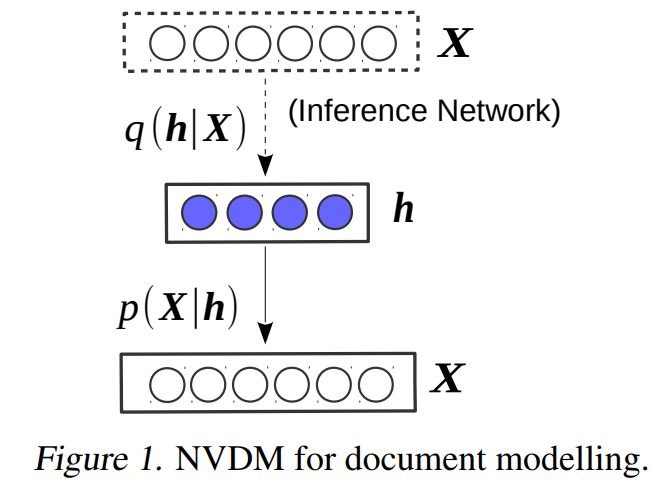

# NVDM
- PyTorch implementation of NVDM(Neral Variational Document Model) 

- NVDM in [Neural Variational Inference for Text Processing](https://arxiv.org/abs/1511.06038). Yishu Miao, Lei Yu, Phil Blunsom. ICML 2016.



## Directories

```
data
  ├── naver_main_news.csv  # Data
  └── stopwords.txt  # 불용어 사전
  
data_loader
  ├── __init__.py
  └── dataset.py  # Dataset & DataModule for NVDM
  
preprocess.py # Preprocess for NVDM
train.py  # train NVDM
README.md
```


## Usage

```
# 1. preprocess
$ python preprocess.py --data_path data --vocab_size 2000 --save_dir data

# 2. train
$ python train.py --data_dir data --vocab_size 2000 --epochs 10
```


## References

- https://github.com/visionshao/NVDM
- https://github.com/YongfeiYan/Neural-Document-Modeling
